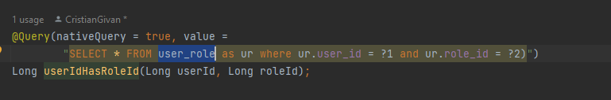

# General

## Not  forget

- user can have a list of users as favorites it can add to his notes or other elements users from this list
- user can search from all users and at another user to his user
- for future the user had to accept to be in other user list
- user email shall be many to many because if a 2 users insert the same email I receive error, coud be 2 users with the
  same email parent children

## ToDo

- [ ] password manager check if the password was used
- [ ] get user by Id Username Email etc. by his userList

### Attributes

- [x] username
- [x] password
- [x] mainEmail
- [x] createdDate
- [x] userList
- [x] Role

### Post

- [x] postUser

### Put

- [x] putUsernameToLogInUser
- [x] putPasswordToLogInUser
- [x] putMainEmailToLogInUser
- [x] putUserToLogInUser
- [x] putRoleToUser

### Delete

- [x] deleteUserFromLogInUser
- [x] deleteRoleFromUser
- [x] deleteUser

### Get

- [x] getAllUser
- [x] getLogInUser
- [x] getUserById
- [x] getUserListByUsername
- [x] getUserListByUsernameContains
- [x] getUserListByMainEmail
- [x] getUserByCreatedDate
- [x] getUserListByCreatedDateBetween
- [x] getUserListByUser // create a list with all users where this user is present
- [x] getUserListByRole

## Other

- [ ] during deleteing the last role standard from User I receive an error 403 and the role is not deleted
  only admin user can do admin things check if is so

When I Change form checked to returning value I get user_role in user repositori

As above see also the user_user

- [ ] DTOF had to add the userList
- [ ] check if it had to be a linking column or linking table -:- linking table because it had to be more to more
- [ ] add tagList to userFDTO

