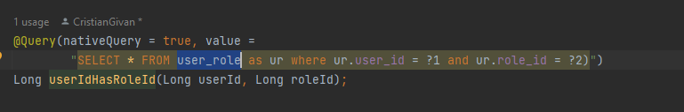

# General

## Not  forget

- user can have a list of users as favorites it can add to his notes or other elements users from this list
- user can search from all users and at another user to his user
- ff the user had to accept to be in other user list

## Controller

### General

- [ ] 
- [ ] 

## Service

### Post

- [ ] 
- [ ] 

## ToDo

- [x] postUser
-
- [x] putRoleToUser
- [x] putUserName
- [x] putUserPassword
- [x] putUserEmail
- [x] putUserToUserList

- [x] getUserList
- [x] getUserById
- [x] getUserListByTagId
- [x] getLogInUser
- [x] getUserByUsername
- [x] getUserListByRole

- [x] deleteRoleToUser
- [x] deleteUserFromLogInUserList
- [x] deleteUserById
- [x] during deleteing the last role standard from User I receive an error 403 and the role is not deleted
  only admin user can do admin things check if is so

When I Change form checked to returning value I get user_role in user repositori

As above see also the user_user

- [x] DTOF had to add the userList
- [x] check if it had to be a linking column or linking table -:- linking table because it had to be more to more
- [x] add tagList to userFDTO

